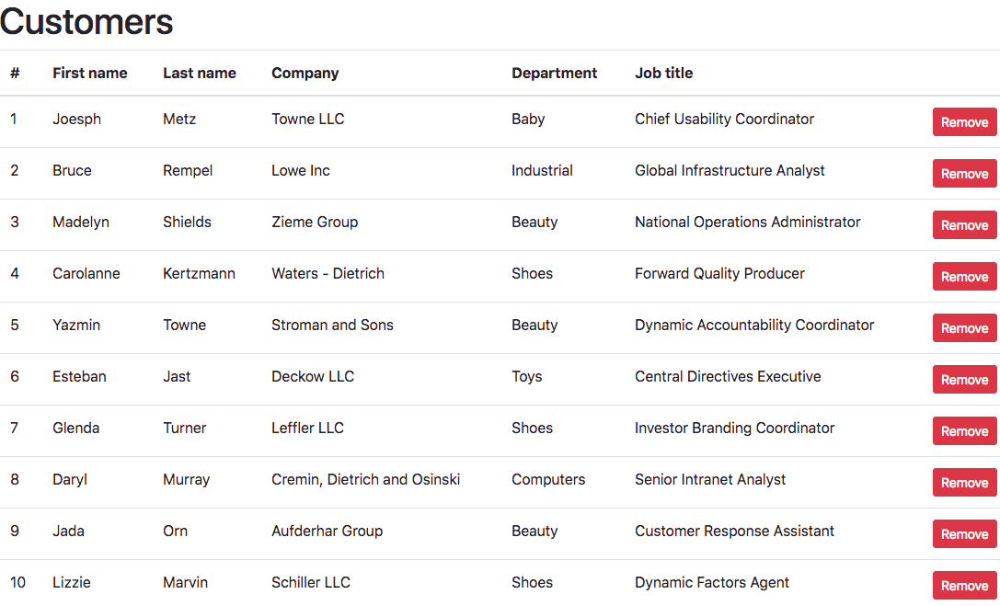

# WORK IN PROGRESS - DANGER HERE!

# Vuex Helper

Creates namespaced Vuex modules based on a given state object with less coding.

### Installation

#### NPM

```
npm i --save @phoobynet/vuex-helper
```

#### Yarn

```
yarn add @phoobynet/vuex-helper
```

## Motivation

I built this as a time saver.  I was writing a Vue.js application for a large legacy CRM system and was getting a lot of change requests that had become a chore.  I wanted a simple way of adding data to state within a module, and not have to worry about add new types, mutations and mappings to components.

## Conventions (that I use)

* Vuex modules are always namespaced.
* Vuex module file names end with `Module.js`, but module names don't, e.g. 'customersModule.js' is registered with the store as 'customers'
* Vuex modules are kept smallish.
* Each value of `state` has a matching `type`
* Each `type` has a matching mutation function that has the same name as the `type` and therefore the `state` property.

### Example

The following is a very simple module with no actions or getters.

To run the example:

Open a terminal and start the server

```bash
npm run run-example-server
```

Open another terminal and start the client

```bash
npm run run-example-client
```

Navigate to [localhost:3001](http://localhost:3001)

You should see something similar to this:




#### customersModule.js (simplified version)
```javascript
import { buildModule } from '@phoobynet/vuex-helper'

const state = {
  fetching: false,
  items: []
}

// create the module based on the above state
const customersModule = buildModule('customers', state)

export default customersModule
```

#### store.js
```javascript
import Vue from 'vue'
import Vuex from 'vuex'
import customers from '@/components/customers/customersModule'

Vue.use(Vuex)

const store = new Vuex.Store({
  strict: true,
  modules: {
    customers
  }
})

export default store

```

`buildModule` takes the module name, and the `state` and returns a `customersModule` with the following properties.

* `state` - the state passed into `buildModule`
* `namespace` - the `namespace` argument passed into `buildModule`
* `namespaced` - set to `true`.  See [Vuex Namespacing](https://vuex.vuejs.org/guide/modules.html#namespacing)
* `stateKeys` - array of keys obtained from the `state` objects.  Useful for creating mixins.
* `defaultState` - copy of `state` that can be used to set a state property back to the original value.
* `types` - object where each property and value matches a property of `state`.  Useful when using `commit`. An error is thrown if an attempt is made to access a property that does not exist.
* `mutations` - object where each function matches a property of `types` and therefore `state`.  When mapping mutations onto a component use the value of `mutationSettersMap`
* `mutationSettersMap` - object where each property is prefixed with `set*` but the value matches a property of `types` and therefore `state`, e.g. `setFetching` maps to the `fetching` mutation function.  Very useful for avoiding collisions when mapping modules onto components.
* `resetState` - function that takes the `context.commit` action vuex function to reset the module `state` back to `defaultState`.
* `mixin` - object that can be mixed into components using `{ mixins: [] }` property.


```
{
    state,
    namespace,
    namespaced,
    stateKeys,
    defaultState,
    types,
    mutations,
    mutationSettersMap,
    resetState,
    mixin
  }
```

### Composing `actions`, `getters` and custom `mutations`

Our `customersModule` in the previous example is pretty dumb.  Let's add the following:

* An action to retrieve `customers`
* Add a couple of getters to determine if we actually have any customers and if a error is set (yes, I know, this is contrived and could be achieved in state)
* A custom or override mutation; in this case one to clear an error and the other to a remove a customer.  Remember, vuex-helper will create default mutation functions for each `state` property, but they can be overridden.  **NOTE: the `mutationSettersMap` is not updated.**

#### customersModule.js (more advanced version)
```javascript
import {
  buildModule,
  compose,
  composeActions,
  composeGetters,
  composeMutations
} from '@phoobynet/vuex-helper'
import customersApi from './customersApi'

const state = {
  customers: [],
  fetching: false,
  error: null
}

const { types, resetState, ...customersModule } = buildModule('customers', state)

const getters = {
  hasCustomers (state) {
    return state.customers.length
  },

  hasError (state) {
    return !!state.error
  }
}

const customMutations = {
  clearLastError (state) {
    state.error = null
  },

  removeCustomer (state, id) {
    state.customers = state.customers.filter(customer => customer.id + '' !== id + '')
  }
}

const actions = {
  cleanUp ({ commit }) {
    resetState(commit)
  },

  async getCustomers ({ commit }) {
    try {
      commit(types.fetching, true)
      commit(types.customers, [])
      commit(types.error, null)

      const customers = await customersApi.getCustomers()

      commit(types.customers, customers)
    } catch (err) {
      commit(types.error, err)
      console.error(err)
    } finally {
      commit(types.fetching, false)
    }
  }
}

export default compose(
  composeActions(actions),
  composeGetters(getters),
  composeMutations(customMutations)
)(customersModule)

```
To pull actions, getters and custom mutations into our `customersModule`, we compose them.

* `composeActions` adds the `actions` object to the module, along with a `actionsKeys` array.  The default `mixin.methods` is updated using `mapActions`.
* `composeGetters` adds the `getters` object to the module, along with a `gettersKeys` array.  The default `mixin.computed` is updated using `mapGetters`
* `composeMutation` overwrites default mutations or adds additional mutations to the module. The default `mixin.methods` is updated using `mapMutations`
* `compose` accepts `n` compose functions, returning a function that is executed with the result of `buildModule` (`customersModule` in this example)


### Preventing name collisions

Calling mutation functions the same name as a state property would cause problems when mapping values and methods onto a component.  Instead, when not using the generated `<module>.mixin`, do the following:

```javascript
import customersModule from './customersModule'
import { createNamespacedHelpers } from 'vuex'

const { mapMutations, mapState } = createNamespacedHelpers(customersModule.namespace)

export default {
  name: 'Customers',
  computed: {
    ...mapState(customersModule.stateKeys)
  },
  methods: {
    ...mapMutations(customersModule.mutationSettersMap),
    
    doSomething () {
      // maps to the mutation 'fetching'
      this.setFetching(true)
    }
  }
}
```

### Using `<module>.mixin`

Dead simple, just import the module, and use the `mixin` property.

```html
<template>
  <div class="mt-2">
    <template v-if="fetching">
      <div class="row">
        <div class="col">
          <div class="text-center mt-5">
            <i class="fa fa-spinner fa-spin fa-3x"></i>
          </div>
        </div>
      </div>
    </template>
    <template v-else-if="hasCustomers">
      <div class="row">
        <div class="col">
          <header>
            <h1>Customers</h1>
          </header>
        </div>
      </div>

      <div class="row">
        <div class="col">
          <customer-list
            @removeCustomer="onRemoveCustomer"
            :customers="customers"
          />
        </div>
      </div>
    </template>
    <template v-else-if="hasError">
      <pre>{{ JSON.stringify(error, null, 2) }}</pre>
      <button
        class="btn btn-warning btn-sm"
        @click="clearLastError"
      >Clear last error
      </button>
    </template>
    <template v-else-if="!hasCustomers">
      <div class="text-center">
        <p class="text-muted">
          No customers here.
        </p>
        <button
          class="btn btn-primary btn-sm text-justify"
          @click="refreshCustomers"
        >Refresh customers
        </button>
      </div>
    </template>
  </div>
</template>

<script>
import CustomerList from './components/CustomerList'
import customersModule from './customersModule'

export default {
  name: 'Customers',
  components: {
    CustomerList
  },
  mixins: [ customersModule.mixin ],
  mounted () {
    this.getCustomers()
  },
  beforeDestroy () {
    this.cleanUp()
  },
  methods: {
    refreshCustomers () {
      this.getCustomers()
    },
    onRemoveCustomer (id) {
      // custom mutation
      this.removeCustomer(id)
    }
  }
}
</script>
```


